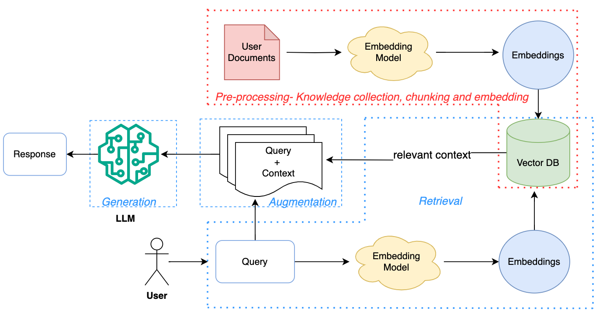

# **Implementing a RAG using LM Studio and PDF files**
A repository for implementing RAG with LM Sutdio API

**What is RAG?**

RAG, or Retrieval Augmented Generation, is a method that combines information retrieval and text generation. First, it retrieves relevant documents from a corpus based on input queries. Then, the retrieved context aids in generating accurate responses, enhancing factuality and context-appropriateness. This approach allows LLMs to incorporate external knowledge effectively, improving performance in tasks needing detailed facts or domain-specific information. This method also improves the efficacy of a large language model (LLM) applications by leveraging custom data.

RAG Architecture

# How to Use
I provided two Code files, `files_to_db.py` and `main.py` which has this jobs:
    
`files_to_db.py` : you can write your pdf documnets  into vector db using this file, you just need to move all of you files into one directory and set you directory address in code using `docs_path` and make a new chroma db or connect to an old one using these two parameters `VECTOR_DB_NAME` , `VECTOR_DB_NAME`.

you can also change you embedding model ny changing `TEXT_EMBEDDING_MODEL` value, i used [BAAI/bge-m3](https://huggingface.co/BAAI/bge-m3) Embedding model, you can replace it with any other Embedding model from HuggingFace.

`main.py` : this file task is to do retrieve data based on your Question and make a prompt with and send a Request to your LLM api, youy can use any model from LM Studio (and any api link!), you just need to replace your model name instead of`MODEL_NAME` and just enjoy it! I used `Qwen2.5-14B-Instruct-GGUF` and it was good. 

Hope You like it, and Dont forget to give me a star if this Repo was halpful for you!
